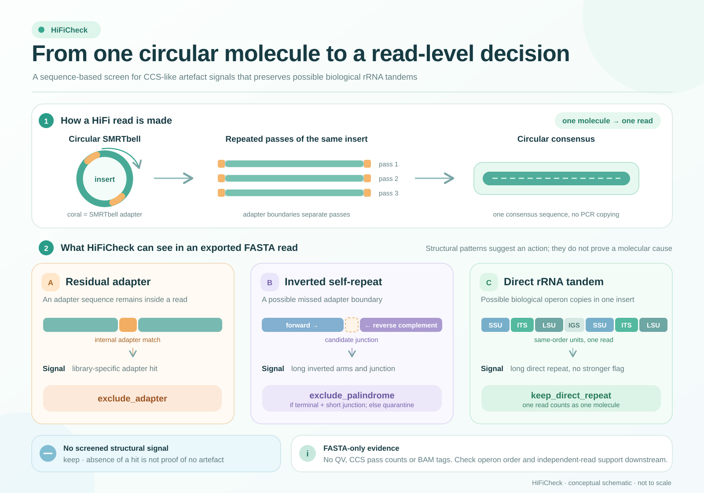

# HiFiCheck

HiFiCheck is a fast, streaming **FASTA** screen for sequence-visible PacBio
HiFi/CCS adapter and self-repeat patterns. It is intended for large collections
of candidate reads, including millions of ITS-bearing metagenomic reads. It
separates direct repeats, which may be genuine tandem rRNA arrays, from
adapter-associated and inverted patterns that should not enter a strict
operon set without further evidence.

HiFiCheck uses C++17 and the standard library. It does not require a virtual
environment, Conda, Python packages or a read database. Python 3 is needed
only to run the optional tests and synthetic benchmark.

**Development attribution:** The code in this repository was developed by
GPT-6 Sol under the guidance and supervision of Yanpeng Chen.



**Conceptual overview.** CCS combines repeated observations of one circular
SMRTbell molecule into one consensus read. A residual adapter can appear
inside a read, while a miscalled adapter can leave long reverse-complement
arms. A genuine tandem rRNA array instead has same-orientation operon copies
in one insert. HiFiCheck uses sequence signals in FASTA to exclude or
quarantine suspicious reads while retaining direct repeats as candidate
biological structures. The diagram is schematic; the sequence patterns do
not prove molecular origin.

[Download the PNG](docs/hificheck_concept_light.png) or
[edit the vector SVG](docs/hificheck_concept_light.svg).

## What it does

- Reads plain, multiline FASTA as a stream; accepts a file or standard input.
- Searches both orientations of an optional, **library-specific** adapter FASTA.
- Samples canonical 17-mers to find long direct and inverted self-repeats.
- Uses a fixed worker pool and bounded input batches. It does not load the
  whole sequence collection into memory.
- Automatically writes a decision for each read with a detected signal and
  can write a FASTA of retained reads. No per-read manual review is required.
- Counts each FASTA record once. Multiple repeated units in one read are **one
  independent molecule**, not multiple supporting reads.

The program does not annotate rRNA genes. Use ITSx or equivalent coordinates
to establish whether a retained direct repeat actually contains two or more
ordered SSU–ITS–LSU operons. Read-level repeat evidence alone cannot establish
intragenomic copy number.

## Install on Linux

Requirements: a C++17 compiler (`g++`), standard `make`, and sufficient disk
space for the output FASTA if you request it. Development was tested with GCC
11.4 on Ubuntu/WSL. Compile on the Linux machine where you will run the tool.

```bash
git clone https://github.com/ypchan/hificheck.git
cd hificheck
make
./bin/hificheck --help
```

If `make` is unavailable, compile directly:

```bash
mkdir -p bin
g++ -O3 -std=c++17 -pthread -Wall -Wextra -o bin/hificheck hificheck.cpp
```

You can run `./bin/hificheck` from the repository. To install the binary under
your own home directory without administrator privileges:

```bash
make install PREFIX="$HOME/.local"
"$HOME/.local/bin/hificheck" --help
```

No environment creation or package manager is involved. To verify the build,
run `make test`. The tests use Python's standard library and synthetic reads;
they do not download data.

## Input

`-i/--input` accepts a plain `.fa`, `.fasta` or `.fna` file, including multiline
records. Use `-i -` for standard input. Each header must begin with `>` and
contain a nonempty identifier. The identifier is the first whitespace-delimited
token; the optional retained FASTA preserves the entire original header. Bases
must use IUPAC DNA symbols. Ambiguity codes other than A/C/G/T are treated as
`N` for exact-repeat screening.

Use **CCS/HiFi consensus reads**, not raw polymerase or subread sequences.
For a metagenomic rRNA study, screening ITS-bearing candidate reads is faster
and more relevant than screening all shotgun reads.

`--adapters adapters.fa` is optional. Supply the actual adapter sequence(s)
for each library or sequencing chemistry, one per FASTA record. Each sequence
must contain at least 24 unambiguous A/C/G/T bases. HiFiCheck tests both
orientations and accepts up to 10% substitutions across a full adapter match.
It does **not** detect indels in adapters. If you omit `--adapters`, the absence
of an adapter hit means **unassessed**, not adapter-free. Do not reuse an
unverified adapter FASTA across unrelated projects.

## Basic usage

With a plain FASTA:

```bash
./bin/hificheck \
  -i fungal_ITS_reads.fasta \
  -o fungal_ITS_reads.hificheck.tsv \
  --retained-fasta fungal_ITS_reads.retained.fasta \
  --adapters library_adapters.fa \
  -t 8
```

If no verified adapter reference is available, omit `--adapters` and treat
adapter status as unassessed. Inverted patterns will still be screened.

For gzip-compressed FASTA, stream decompression into HiFiCheck. `pipefail`
makes a decompression error fail the overall command:

```bash
set -o pipefail
gzip -dc fungal_ITS_reads.fasta.gz | ./bin/hificheck \
  -i - \
  -o fungal_ITS_reads.hificheck.tsv \
  --retained-fasta fungal_ITS_reads.retained.fasta \
  --adapters library_adapters.fa \
  -t 8
```

For multiple samples or libraries, run one command per sample/library with a
distinct output prefix and the correct adapter FASTA. Keep the sample ID and
read/ZMW identifiers for later independent-read support checks. A FASTA header
without a reliable original molecule ID cannot by itself prove independence.

## Automatic decisions

| `qc_action` | Sequence signal | Included in `--retained-fasta`? |
| --- | --- | --- |
| `exclude_adapter` | Known adapter inside a read, at least 100 bp from each end | No |
| `exclude_palindrome` | Long inverted arms meeting near a short junction and a read end | No |
| `quarantine` | Other inverted repeat or terminal adapter | No |
| `keep_direct_repeat` | Long direct repeat without the above signals | **Yes** |
| `keep` | None of the screened signals | Yes |

An adapter hit takes priority over repeat patterns. A direct repeat **alone is
never classified as a CCS error**. The `keep_direct_repeat` category is a
candidate structural feature, not proof that the repeat consists of rRNA
operons or is a true genomic array. The three excluded/quarantined categories
are automatically omitted from the optional retained FASTA. Their evidence
stays in the report; they do not require manual triage to run the pipeline.

These decisions are deliberately conservative for a strict operon dataset.
They are sequence-based heuristics, not an error-rate model. Adapter-free
direct concatemers and other artefacts can be missed, particularly without a
verified adapter sequence. Conversely, a biological inversion can enter
`quarantine`. Apply independent-read and ITSx structure rules downstream.

## Output files

For `-o PREFIX.tsv`, HiFiCheck writes:

| File | Contents |
| --- | --- |
| `PREFIX.tsv` | One row per read with a signal; use `--all` to include plain `keep` reads |
| `PREFIX.tsv.summary.json` | Total reads and bases, action counts, feature counts, parameters and throughput |
| `PREFIX.tsv.quarantine.ids` | IDs assigned `exclude_adapter`, `exclude_palindrome` or `quarantine` |
| `PREFIX.tsv.direct_repeat.ids` | IDs assigned `keep_direct_repeat`; these reads remain retained |
| Path from `--retained-fasta` | Full FASTA of `keep` and `keep_direct_repeat` reads |

The TSV includes adapter name, orientation, mismatch count and coordinates,
plus the best long-repeat orientation, spans and seed-pair count. Coordinates
are zero-based and half-open. A blank adapter field means no match was found
under the supplied adapter reference, or that no reference was supplied. Check
the summary's `adapters` field to distinguish those cases. Output files are
protected against accidental overwriting; use `--force` to replace a previous
run intentionally. An interrupted run should be rerun with a new output prefix
or `--force`; only a successfully completed run writes a fresh summary JSON.

FASTA does not contain base qualities or PacBio BAM auxiliary tags. HiFiCheck
cannot infer Q20/Q30, `af`, `ma`, `ac`, pass count or CCS consensus accuracy
from a FASTA file. Those checks require the corresponding FASTQ/BAM or
sequencing records.

## Parameters and performance

```text
-t, --threads N         Worker count; default min(8, available hardware threads)
--min-repeat-span N     Minimum seeded repeat span; default 1,800 bp
--min-seed-pairs N      Coherent seed pairs required; default 8
--seed-mod N           Sample approximately 1/N canonical 17-mers;
                       default 16, power of two from 1 to 256
--batch-bases N        Approximate input bases per worker batch;
                       default 2,097,152
--all                  Include plain keep reads in the TSV
--force                Replace existing output files
```

Smaller `--seed-mod` values sample more k-mers and increase sensitivity and
CPU/memory cost. Larger values run faster but can miss weaker repeats. More
threads help only until storage or memory bandwidth becomes limiting. For
very large datasets, keep `--all` off so the TSV does not contain millions of
routine rows. The optional retained FASTA can approach the size of the input.

In a synthetic Linux/WSL test, 100,000 reads of 5 kb each (500 Mb total,
1,024 different sequences) were processed at about **35,400 reads/s** with
eight workers, a synthetic 46 bp adapter reference and retained FASTA output.
This is **not** a guarantee for real samples; read lengths, repeat content,
compression and storage can change the rate. Reproduce the benchmark with:

```bash
python3 bench/benchmark_hificheck.py \
  --reads 100000 --length 5000 --threads 8 --adapter --retained
```

## Suggested operon workflow

1. Obtain genuine HiFi/CCS reads and preserve sample and original molecule
   identifiers. If available, apply base-quality filtering before FASTA export.
2. Detect ITS-bearing reads and annotate SSU, ITS1, 5.8S, ITS2 and LSU with
   ITSx or an equivalent tool.
3. Run HiFiCheck on candidate FASTA reads. Continue operon extraction only
   from the retained FASTA. Keep `keep_direct_repeat` reads for automated
   operon-order analysis.
4. Use gene coordinates to require the expected orientation and order for each
   operon. Record multiple ordered operons on one read as candidate copies,
   while counting that read as **one** molecule.
5. Cluster operons and require support from at least two independent HiFi
   reads/ZMWs for a high-confidence cluster. A sequence-only FASTA ID must be
   checked against the original naming convention before treating two IDs as
   independent molecules.

HiFiCheck implements step 3. It does not replace ITSx, clustering, chimera
analysis, SSU/LSU phylogenetic checks or independent-molecule validation.

## Background

PacBio's CCS documentation distinguishes tandem-repeat metrics from adapter
concatenation, adapter-palindrome and adapter-residue failure classes:
[CCS reports and auxiliary files](https://ccs.how/faq/reports-aux-files.html).
[HiFiAdapterFilt](https://github.com/sheinasim-USDA/HiFiAdapterFilt) is an
existing adapter-contamination filter for HiFi reads; HiFiCheck additionally
separates long direct from inverted self-repeat patterns in FASTA input.

## License

HiFiCheck is released under the [MIT License](LICENSE).
